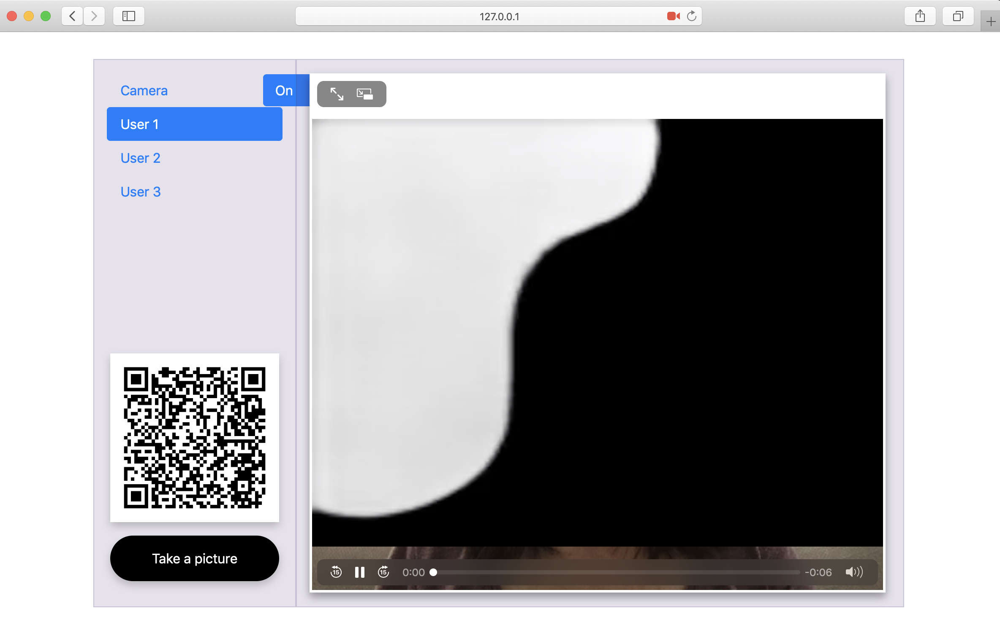

# LearningToPaintDemo

This is a demo frontend of "Learning to Paint", a Reinforcement Learning based painting agent. The demo applied pre-trained models from [ICCV2019-LearningToPaint](https://github.com/megvii-research/ICCV2019-LearningToPaint), including both actor and renderer.



## Installation

Use the package manager [conda](https://anaconda.org/anaconda/conda) to install dependencies.

```bash
conda install -r requirements.txt -n learningtopaint
conda activate learningtopaint
```

Install ffmpeg, for Mac users:

```bash
brew install ffmpeg
```

## Usage

```bash
python setup.py install
export FLASK_APP=app
export FLASK_DEBUG=true
flask run
```

Go to `http://127.0.0.1:5000` (allow camera to be used in browser)

Run tests:
```
pytest -v 
```

## Contributing
Pull requests are welcome. For major changes, please open an issue first to discuss what you would like to change.

Please make sure to update tests as appropriate.

## License
<!-- [MIT](https://choosealicense.com/licenses/mit/) -->
